**SENG 637 - Dependability and Reliability of Software Systems**

**Lab. Report \#4 – Mutation Testing and Web app testing**

| Group: 9               |
| ---------------------- |
| Moaz Barakat           |
| Juan Celis             |
| Bogdan Constantinescu  |
| Andy Guevara           |
| Billy Sidharta         |

# Introduction

This assignment is about understanding the basics of Mutation Testing and GUI Testing. There are two independent objectives to be completed:

- Part 1: Mutation Testing
- Part 2: GUI Testing

## Mutation Testing

The system under test (SUT) is a modified version of JFreeChart which is an open-source Java framework for charts. We are required to measure and improve the mutation score of the tests related to `Range` and `DataUtilities` test classes.

## GUI Testing

The web application under test is the graphical user interface of Home Depot (our choice for this part) which is a home improvement retailer. As a group, we are required to design, automate, and verify UI test cases of at least 10 different functionalities.

The following were used to complete this assignment:

- IDE: Eclipse (2023)
- Unit testing: JUnit 4.x
- Mocking: Jmock
- Coverage tool: EclEmma
- Mutation tool: Pitest
- GUI tool: Selenium

Additionally, the assignment aims to help us gain an understanding of what mutation testing is and why it is useful. By completing the assignment, we also should have some familiarization with automated GUI testing and become comfortable with some of the features of GUI testing tools.

# Analysis of 10 Mutants of the Range class 

The following section analyzes 10 mutants produced by Pitest for the `Range` class and outline whether they were killed or not.

## Mutant 1

**The mutant**:

```
Incremented (++a) double field lower 
```

**The effected code**:

```
 public double getLowerBound() {
        return this.lower; //this line
 }
```

**Analysis**:

Status - <span style="color:green">KILLED</span>

The mutation is created by incrementing the lower variable which is of type double by 1 [++(this.lower)]. Note that this is a pre-incrementor which means the addition will be applied first to the variable. Thus, we expect that the mutant can be killed. Generally speaking, the increment mutants are tricky to kill depending on if its a pre or post incrementor. In some cases, specially with the post incrementors, the result is an equivalent muatant which cannot be killed. A simple test case that we designed that killed this is getLowerBoundShouldBeThree.

## Mutant 2

**The mutant**:

```
Decremented (a--) double field lower → KILLED 
```

**The effected code**:

```
 public double getLowerBound() {
        return this.lower; //this line
 }
```

**Analysis**:

Status - <span style="color:green">KILLED</span>

The mutation is created by decrementing the lower variable which is of type double by 1[(this.lower)--]. Note that this is a post-decrementor which means the subtraction will be applied later to the variable once the statement is executed. However, since the decrement happens during the return statement, it will not make a difference whether its post or pre decrement as this is the last line of the code. Thus, we expect that the mutant can also be killed for this method similar to mutant 1 above. A simple test case that we designed that killed this is getLowerBoundShouldBeThree.

## Mutant 3

**The mutant**:

```
Replaced double subtraction with addition → KILLED
```

**The effected code**:

```
public double getLength() {
	return this.upper - this.lower; //this line
}
```

**Analysis**:

Status - <span style="color:green">KILLED</span>

The mutation is created by replacing the subtraction operator with addition [this.upper + this.lower]. This effectively results in a different length. Thus, we expect a good test case would be able to kill the mutant. Generally speaking, we found that this style of mutants are typically killed since they tend to alter the result. A simple test case that we designed that killed this is lengthValueShouldBeFour.

## Mutant 4

**The mutant**:

```
Decremented (a--) double local variable number 3 → SURVIVED
```

**The effected code**:

```
public Range(double lower, double upper) {
	if (lower > upper) {
			String msg = "Range(double, double): require lower (" + lower
			    + ") <= upper (" + upper + ").";
			throw new IllegalArgumentException(msg);
		}
		this.lower = lower;
		this.upper = upper; // this line
	}
}
```

**Analysis**:

Status - <span style="color:red">SURVIVED</span>

The mutation is created by decrementing the method argument upper variable which is of type double by 1 [this.upper = upper--]. Note that this is a post-decrementor which means the subtraction will be applied later to the upper variable once the statement is executed. However, unlike mutant 2 above, the upper value is decremented after the statement and will be impossible to reflect this to this.upper. Thus, we expect that the mutant can not be killed since it is an equivalent mutant. There are no test cases that can be applied that would allow this mutant to be killed. Generally speaking, ++a tends to produce less equivalent mutants than a++.

## Mutant 5

**The mutant**:

```
removed call to java/lang/StringBuilder::append → KILLED
```

**The effected code**:

```
 public String toString() {
    return ("Range[" + this.lower + "," + this.upper + "]"); // this line
}
```

**Analysis**:

Status - <span style="color:green">KILLED</span>

The mutation is created by removing one of the call of append (+) to the strings. This effectively results in a different string being generated. Thus, we expect a good test case would be able to kill the mutant. Generally speaking, we found that this style of mutants are typically killed since they tend to alter the result. A simple test case that we designed that killed this is toStringShouldReturnSameRange. 

## Mutant 6

**The mutant**:

```
Substituted 2.0 with 1.0 → KILLED
```

**The effected code**:

```
 public double getCentralValue() {
    return this.lower / 2.0 + this.upper / 2.0; //this line
}
```

**Analysis**:

Status - <span style="color:green">KILLED</span>

The mutation is created by replacing one of the value of 2.0 with 1.0 [this.lower / 1.0 + this.upper / 2.0]. This effectively results in a different central value. Thus, we expect a good test case would be able to kill the mutant. Generally speaking, we found that this style of mutants are typically killed since they tend to alter the result. A simple test case that we designed that killed this is centralValueShouldBeFive.

## Mutant 7 

**The mutant**:

```
negated conditional → KILLED
```

**The effected code**:

```
public boolean intersects(double b0, double b1) {
    if (b0 <= this.lower) { // this line
        return (b1 > this.lower);
    }
    else {
        return (b0 < this.upper && b1 >= b0);
    }
}
```

**Analysis**:

Status - <span style="color:green">KILLED</span>

The mutation is created by negating the condition in the if statement [!(b0 <= this.lower)]. This effectively results in a different branch. Thus, we expect a good test case would be able to kill the mutant. Generally speaking, we found that this style of mutants are typically killed since they tend to alter the result. A simple test case that we designed that killed this is intersectLowerRangeBranchOneShouldBeTrue.

## Mutant 8

**The mutant**:

```
not equal to equal → KILLED
```

**The effected code**:

```
public static Range combine(Range range1, Range range2) {
    if (range1 == null) { // this line
        return range2;
    }
    if (range2 == null) {
        return range1;
    }
    double l = Math.min(range1.getLowerBound(), range2.getLowerBound());
    double u = Math.max(range1.getUpperBound(), range2.getUpperBound());
    return new Range(l, u);
}
```

**Analysis**:

Status - <span style="color:green">KILLED</span>

The mutation is created by changing the condition from == to != in the if statement [range1 != null]. This effectively results in a different branch. Thus, we expect a good test case would be able to kill the mutant. Generally speaking, we found that this style of mutants are typically killed since they tend to alter the result. A simple test case that we designed that killed this is combineRangeWithFirstRangeNullShouldBeSecondRange.

## Mutant 9

**The mutant**:

```
replaced return value with null → KILLED
```

**The effected code**:

```
public static Range combine(Range range1, Range range2) {
    if (range1 == null) {
        return range2;
    }
    if (range2 == null) {
        return range1;
    }
    double l = Math.min(range1.getLowerBound(), range2.getLowerBound());
    double u = Math.max(range1.getUpperBound(), range2.getUpperBound());
    return new Range(l, u); // this line
}
```

**Analysis**:

Status - <span style="color:green">KILLED</span>

The mutation is created by changing the return value to null [return null]. This effectively results in a different output. Thus, we expect a good test case would be able to kill the mutant. Generally speaking, we found that this style of mutants are typically killed since they tend to alter the result. A simple test case that we designed that killed this is combineRangeWithSameRangeShouldBeSameRange.

## Mutant 10

**The mutant**:

```
removed conditional - replaced comparison check with false → KILLED
```

**The effected code**:

```
public Range(double lower, double upper) {
    if (lower > upper) { // this line
        String msg = "Range(double, double): require lower (" + lower
            + ") <= upper (" + upper + ").";
        throw new IllegalArgumentException(msg);
    }
    this.lower = lower;
    this.upper = upper;
}
```

**Analysis**:

Status - <span style="color:green">KILLED</span>

The mutation is created by changing the conditional to false [if(false)]. This effectively results in a different branch. Thus, we expect a good test case would be able to kill the mutant. Generally speaking, we found that this style of mutants are typically killed since they tend to alter the result. A simple test case that we designed that killed this is rangeInitializationShouldFailWithInvalidRange.

# Report all the statistics and the mutation score for each test class

The screenshots below demonstrate the before and after improvement of each test class. Note that for this assignment the focus was only on `DataUtilities` and `Range` class. Thus 

## DataUtilities

### Before

Below are the results before the tests improved

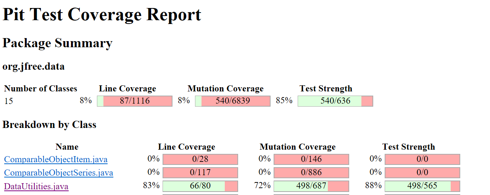

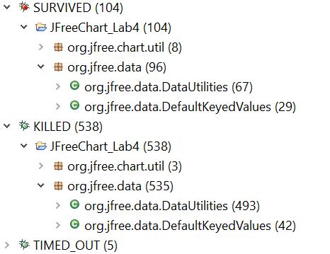

### After

Below are the results after the tests improved

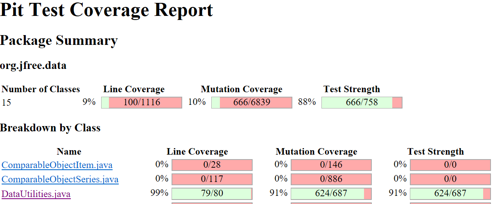

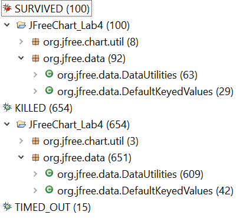

## Range

### Before

Below are the results before the tests improved

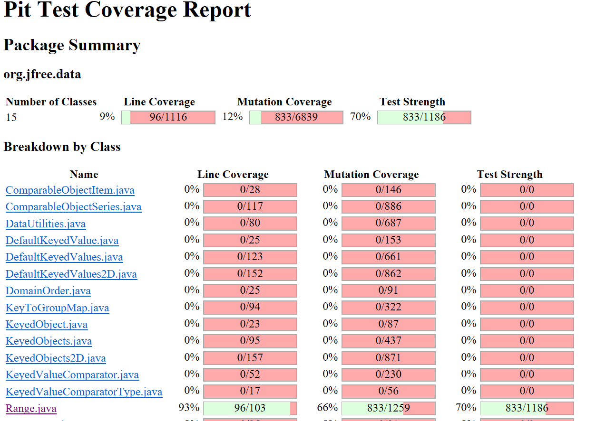

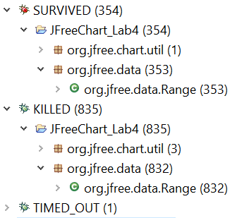

### After

Below are the results after the tests improved

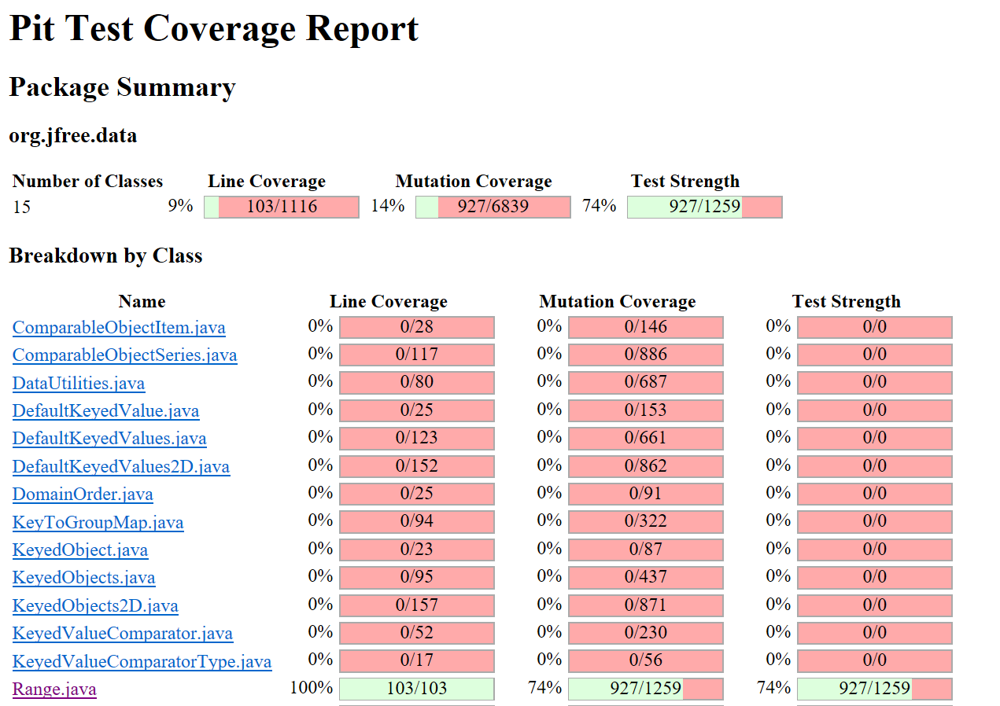

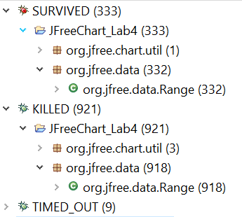


# Analysis drawn on the effectiveness of each of the test classes

Our coverage for both the `Range` and the `DataUtilities` were adequately effective as they were >50% from assignement 3. When we evaluated the PIT summary, we realized that we could kill some legitimate mutants by adding more test cases that increases coverage of the code since our coverage was not 100%. However, we also found out that there were a lot of equivalent mutants that the Pitest generated that we would not be able to kill with test cases. Ultimately, we started increasing our code coverage and analyzed the summary report to see if our coverage was sufficient to kill the survived mutant for both classes. 

For the `Range` class, some of the tests we had to implement were related to expandToInclude, shiftRange and combineIgnoreNan. For the `DataUtilities` class, some of the test we had to implement were related to clone, calculateColumnTotal and calculateRowTotal. Generally speaking, once we implemented more coverage, we were able to reach the 10% increase and meet the assignment target. We still went through the PIT summary and tried to improve beyond 10% but we were saturated for the `Range` class up to 74% and for the `DataUtilities` up to 91%. Most of the survived mutants at that stage were equivalent mutants or still-born mutants that cannot be removed. We thought it would be impossible to achieve 100% mutant coverage because of those reasons. Finally, its worth to note that as per lecture notes some programs can have between 4% to 45% equivalent mutants. 
 

# A discussion on the effect of equivalent mutants on mutation score accuracy

The effect of equivalent mutants has direct negative correlation as it reduces the mutation score accuracy. Equivalent mutants are mutants generated that always acts in the same behavior as the original program. In a scenerio where we have a legitimate mutant, we can increase the number of test suites to target the survived mutant and increase mutation score accuracy. However for equivalent mutants, there are no test cases that could be created to kill these mutants. From lecture, 

```
mutation score = the # mutants killed/ # total mutants. 
```

Since total number of mutants also includes equivalent mutants, this inflates the total # mutants and effectively causes the score to decrease which makes it seem like the test suites were less effective than they really are. Another issue is identifying equivalent mutants which was not easy. 

Our process basically involved:

- Examine all the mutations generated in the summary report by Pitest for each test class
- See which mutants survived and drill down deeper to see what the mutation is
- Determine manually if the mutant was functionally identical although syntactically different
- If it is, it was most likely an equivalent mutant. If not, we would come up with a test case to kill the mutant 
- Each manual detection took us on average ~10 min which was very time consuming

As we got more acquainted to how mutations were generated, we noticed some patterns of equivalent mutants. Below are some of our common findings

- Changing conditional from < to != in `for` loops
- Post Incrementing/decrementing of a return variable (e.g this.upper = upper++)

After doing our own research, it seems that a lot of test engineers also find equivalent mutants takes considerable time and is an on going difficulty. We saw that there are research papers tackling the Equivalent Mutant Problem (EMP). However, that was beyond the scope of this assignment. Below are suggested ways we thought can potentially handle equivalent mutants in the future:

- Detection by advanced algorithms - better software
- Detection by machine learning - perhaps reinforced learning
- Detection by comparing against a list of typical equivalent mutants in the past
- Selective mutant generation methods to avoid generating junk mutants from the source

# A discussion of what could have been done to improve the mutation score of the test suites

One of the easiest ways to improve the mutation score of test suites would be to increase the number of tests to kill legitimate mutants that are found and survived. The tests can still follow black/white box testing techniques we developed in assignment 2/3. This is the most simplest way to improve the mutation score. Below are other ways we can improve the mutation score:

- Increasing instruction coverage - results in killing mutants not targeted
- Increasing branch coverage - results in the improvement of replacing operators mutants
- Ensure right assertion is in place - assertBoolean vs assertEqual
- Including at least two valid inputs - results in the improvement of computational mutants
- Create a list of common equivalent mutants - save time by ignoring those, checking frequency

As an example, we saw that our coverage for the DataUtilities clone method was not great. We added more tests such as cloneOfArrayWithNullsShouldHaveOneLength and cloneOfArrayShouldBeSameLength that resulted in much better mutation coverage of that method and the overall class.

# Why do we need mutation testing? Advantages and disadvantages of mutation testing

As per lecture notes, the goal of mutation testing is to to have a strong (effective) test suite which will be able to catch typical faults. Coverage metrics alone cannot ensure quality of testing so mutation testing is another testing method added to the arsenal. Mutation testing can help enhance weak test cases and identify missing ones. Due to the comprehensive mutations generated and the amount of time spent investigating code, it will almost always result in a more robust software program.

## Advantages

Below are some of the advantages of mutation testing:

- Determine the strength of current test suite against typical faults
- Enhances weak test cases and identifies missing ones
- Increases code coverage to kill survived mutants
- Increases number of tests to ensure reliable and robust code
- Ensures a statement is reached
- Ensure an overall high quality of tests and coverage 

## Disadvantages

Below are some of the disadvantages of mutation testing:

- Very high computational cost
- Takes a very long time to test, very time-consuming
- Difficult to identify equivalent mutants, stil-borns etc.
- Sometimes difficult to create a test case to kill a specific mutant
- Required tools such as Pitest takes some time to get familiar with 
- Lack of good documentation what each mutant generated does 


# Explain your SELENUIM test case design process

## Process

The first step we had to do was decide on which of the three websites suggested we were going to test. The three websites suggested were:

- Shop Smart Canada
- Home Depot 
- Leon’s 

All group member took some time to checkout the websites. We collectively decided to UI test [Home Depot](https://www.homedepot.ca) which is one of the largest home improvement retailer in Canada.

Afterwards, we all browsed and identified the important functionalities and features associated with the website. Below is the combined list of functionalities that the team decided to test. Note that there other functionalities of the website beyond these 10, however these were the ones we were interested in:

- Login - typical for most websites
- Searching a product by name - typically users look for a specific product 
- Searching a product by SKU# - sometimes we know the exact SKU# of the product
- Product details - checkout out the product before adding to cart
- Add item to cart - typical for most retail websites
- Increase item count - typical for most retail websites
- Remove item from cart - typical for most retail websites
- Change store location - typically used for delivery or flyers
- Checkout flyer - typically users checkout flyers for deals
- Customer service - E.g find a phone number to talk to

Subsequently, a test plan was generated to determine how these functionalities can be test and confirmed. We also wanted to cover different input scenarios to verify that the website functioned as expected. Examples include using different input logins, different input search terms, different postal codes for  flyers etc. All the tests are included in the `Selenium Tests` folder.

The following table shows our test plan:

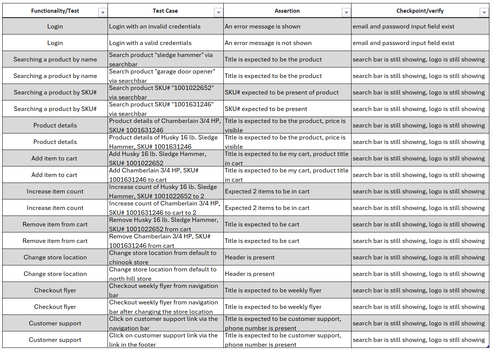


# Explain the use of assertions and checkpoints

Both assertions and checkpoints are placed to confirm and verify that the functionality is working as expected. Assertions allows us to make sure that a certain condition passes before proceeding. If the assert fails, it will stop the test from executing and log the failure. Checkpoints/verification points are similar, however they still allow the execution of the test even if the checkpoint/verification point(s) fails. Normally, assertion are used to ensure critical functionality required is met for the application under test while checkpoints allow us to gather more information about the application and tests. For our tests, we made sure that the assertion allow us to check that the functionality is met. Additionally, we also used checkpoints to make sure the website is still by checking if elements are present. See table in the above section for additional details.

Note we could have had many assertions and checkpoints. However, to keep the workload manageable we decided to limit the tests to include at least 1 assertion and at least 2 checkpoints.

The following table below shows the associated tests as well as the number of asserts/checkpoints used:

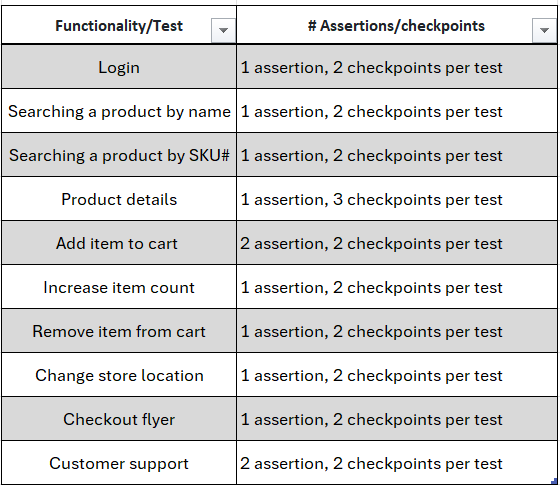


# how did you test each functionality with different test data

We used different test data per test. Some tests involved a valid and an invalid test. For example the login test used a valid and an invalid credentials. In other cases, the invalid tests did not make so much sense to include. For example, the customer support test as there is nothing to input. In those scenarios, we made sure to at least have two valid tests for each case. Overall, our strategy was to use different test data to test each functionality.

The table below shows the description of the different test data we used:

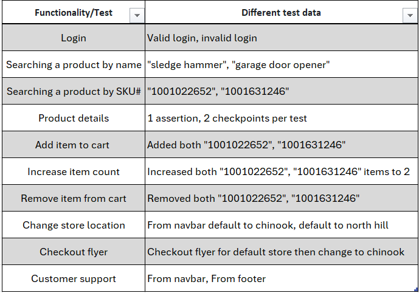

# How the team work/effort was divided and managed

Similar to other assignments, the test plan and strategy was developed together from all team members.

## Mutation testing

We split into two groups to look at the Pitest mutations and summary report. The first group focused on the Range class while the second group focused on DataUtilities class. All the group members worked together to detect and create test cases for legitimate mutants that survived. Once both groups have completed their testing, we scheduled a peer review meeting to combine and go over the issues found from each group.

Group 1: Bogdan and Andy

Group 2: Juan, Billy and Moaz

## GUI testing

We spent time checking out the suggested websites to test. We all thought homedepot would be a good site to test. Once we decided on the website, each group member came up with two functionalities to test. Afterwards, we went over them collectively as a group. We then split into two groups to apply the UI tests together. Once both groups have completed their testing, we scheduled a peer review meeting to combine and go over the issues found from each group. 

Group 1: Bogdan and Andy

Group 2: Juan, Billy and Moaz

# Difficulties encountered, challenges overcome, and lessons learned

For the mutation testing, we received a lot of errors in the console window about Pitest. Additionally, the tests were taking very long time to generate ~30 min which had us worried. Eventually after the first PIT summary was generated we realized this is typical for the mutant generation. Ultimately we learned learned to be patient with the subsequent generations. Additionally, we also had to get acquainted with investigating the generation summary report and see what survived from what failed. Ultimately, we learned to overcome this challenge.

For the GUI testing, we did not have any prior experience with selenium or other GUI testing tools. This required us to learn how to use the software features to complete the assignment. Overall, we learned to overcome this challenge by getting acquainted with the software and practicing recording the tests.

# Comments/feedback on the assignment itself

We all thought the lab was very helpful as it exposed us to mutation and GUI testing. Additionally, we also thought the instructions of the lab was structured well. Recommendation for part two would be to expand the GUI testing to a wider variety of websites and not limit to 3.
